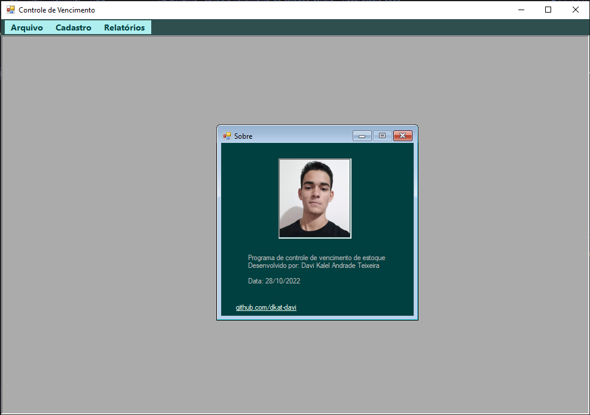
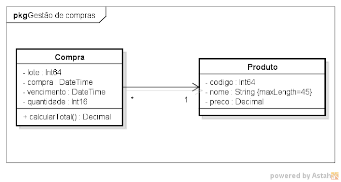
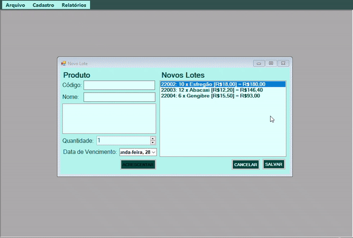

<h1 align="center">Controle de Vencimento de Estoque</h1> 

    
    

 

    

<h2>&#X1F4DD Descrição do projeto</h2>

Tendo o template dos relatórios e o <b>UML</b> de duas classes do projeto, tive o objetivo de criar um sistema que gerencie a compra de lotes de produtos e gere relatórios de vencimento dos lotes.

    

<h2>&#X1F528 Funcionalidades do projeto</h2>

<ul>
    <li>Tela principal com um MenuStrip para acesso ao sair, sobre e as outras janelas</li>
    <li>Menu de Cadastro com acesso a compra de um novo lote</li>
    <li>Menu de relatórios com acesso a relatórios de vencimentos de lotes</li>
    <li>Janelas de de ralatórios de lotes vencidos em, 1 dia, 5 dias, vencimento personalizado e todos os lotes</li>
</ul>

    

<h2>&#X1F195 Funcionalidades adicionais</h2>

<ul>
    <li>Excluir lote antes de finalizar a compra</li>
</ul>

    

<h2>&#X1F4C1 Acesso ao projeto</h2>

Acesse o <a href="https://github.com/DKAT-DAVI/controle-vencimento-de-estoque-Csharp">repositório do projeto</a> e faça download do repositório, seja via <a href="https://github.com/DKAT-DAVI/controle-vencimento-de-estoque-Csharp/archive/refs/heads/main.zip">arquivo.zip</a> ou fazendo um git clone do repositório na sua máquinae compile o programa usando o <a href="https://visualstudio.microsoft.com/downloads/">Visual Studio</a>.

<h2>&#X2714 Técnicas e Tecnologias utilizadas</h2>
<ul>
    <li>
        Linguagem C#
    </li>
    <li>    
        
        Visual Studio  
    </li>
    <li><bigger><b>POO</b></bigger> programação orientada a obejtos</li>

</ul>

<h2>&#X1F4DE Contato</h2>

          
[)](https://www.linkedin.com/in/dkat-davi/)

<footer align="justify">
    
Projeto da matéria de Programação Visual atribuido pelo professor <a href="https://github.com/guisso">Luis Guisso<a> do IFNMG - Montes Claros com o intuito de testar os conhecimentos em <b>POO</b>, <b>C#</b> e criação de interfaces.
<footer>
